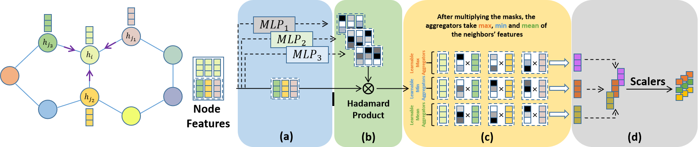

# Multi-Mask Aggregators for GNNs

Implementation of Multi-Masked Aggregators for Graph Neural Networks in Pytorch and PyTorch Geometric. <!--**Preprint will be published soon!**-->

 	
[](https://paperswithcode.com/sota/graph-regression-on-zinc?p=multi-mask-aggregators-for-graph-neural)

> *One of the most critical operations in graph neural networks (GNNs) is the aggregation operation, which aims to extract information from neighbors of the target node. Several convolution methods have been proposed such as standard graph convolution (GCN), graph attention (GAT), and message passing (MPNN). In this study, we propose an aggregation method called Multi-Mask Aggregators (MMA), where the model learns a weighted mask for each aggregator before collecting neighboring messages. MMA draws similarities with the GAT and MPNN but has some theoretical and practical advantages. Intuitively, our framework is not limited by the number of heads from GAT and has more discriminative than an MPNN. The performance of MMA was compared with the well-known baseline methods in both node classification and graph regression tasks on widely-used benchmarking datasets, and it has shown improved performance.*

Check out our paper below for more details

> [**MMA: Multi-Masked Aggregators for Graph Neural Networks**](https://openreview.net/forum?id=hZ3b8CskgC),            
> [Ahmet Sarıgün](https://asarigun.github.io/), [Ahmet S. Rifaioğlu](https://saezlab.org/person/ahmet-sureyya-rifaioglu/),
> *OpenReview, 2022* 

<p align="center"></p>

## Overview

In ```node_classification``` folder, it contains;
* ```data/```: Datasets (**Cora**, **Citeseer**, **Pubmed**) for Node Classification
* ```utils.py```: Loading Dataset
* ```layers.py```: **GCN** and **Multi-Masked Aggregator Layers**
* ```models.py```: **Multi-Masked Aggregators** Model
* ```scalers.py```: **Scalers** for Multi Aggregators
* ```train.py```: **Training** for **Node Classification**


In ```graph_regression``` folder, it contains;
* ```geometric_linear.py```: Multi Mask Layers for each **Aggreation**
* ```mma_conv.py```: **MultiMaskConv**
* ```mma.py```: Training scripts for **ZINC** dataset

## Requirements

* Python 3.8
* PyTorch 1.9
* CUDA 11.1

## Datasets

* Node Classification: ```Pubmed```, ```Citeseer```, ```Cora```.
* Graph Regression: ```ZINC```

## Usage

### Node Classification

Go to ```node_classification``` folder by:

```bash
cd node_classification/
```

- For Node classification on Pubmed:

```bash
python train.py --aggregators min,min2,min3,min4 --dataset "pubmed" --lr=0.01 --epochs=500 --weight_decay=5e-4 --hidden=16 --dropout=0.5
```

- For Node classification on Citeseer:

```bash
python train.py --aggregators min,min2,min3 --dataset "citeseer" --lr=0.01 --epochs=500 --weight_decay=3e-4 --hidden=128 --dropout=0.5
```

- For Node classification on Cora:

```bash
python train.py --aggregators mean,mean2 --dataset "cora" --lr=0.001 --epochs=200 --weight_decay=3e-4 --hidden=64 --dropout=0.75
```

### Graph Regression

Go to ```graph_regression``` folder and run:

```bash
cd graph_regression/
python mma.py --aggregators min,max --weight_decay 3e-4 --scalers identity,amplification,linear --lr 0.0001 --epochs 10000
```

## License

MIT

## Citation

```bibtex
@inproceedings{sar{\i}g{\"u}n2022multimask,
  title={Multi-Mask Aggregators for Graph Neural Networks},
  author={Ahmet Sar{\i}g{\"u}n and Ahmet Sureyya Rifaioglu},
  booktitle={Learning on Graphs Conference},
  year={2022},
  url={https://openreview.net/forum?id=hZ3b8CskgC}
}
```

## References

In each file, we indicate whether a function or script is imported from another source. Here are some excellent sources from which we benefit:

- ZINC Implementation from [PyG Team](https://github.com/pyg-team/pytorch_geometric)
- Node classification from [Original GCN Implementation](https://github.com/tkipf/pygcn) and [LA-GCN](https://github.com/LiZhang-github/LA-GCN/tree/master/code)
